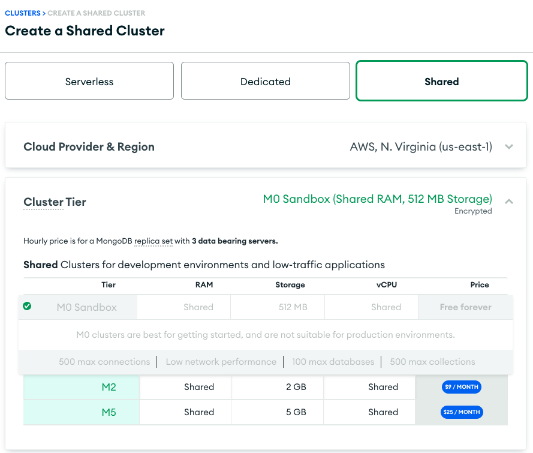

# Implementación de Vector Search con OpenAI y MongoDB

Este repositorio contiene algunos scripts e información que te ayudarán a implementar Vector Search utilizando OpenAI y MongoDB. Próximamente, se incluirá un blog con las instrucciones de todos los pasos.

## Requisitos

Para crear este demo, necesitarás lo siguiente:

- Una cuenta de [MongoDB Atlas](https://www.mongodb.com/es/cloud/atlas/register) en MongoDB Atlas.
- Una cuenta en [OpenAI](https://openai.com/).

Mantente atento a futuras actualizaciones donde compartiremos más recursos y guías detalladas.

## Cargar datos de prueba

Dentro de MongoDB, necesitas crear un cluster; puedes utilizar el M0 para probar. Posteriormente, agregaremos una imagen para que sepas cómo se realiza.


Después, puedes cargar la data de prueba que incluye la colección `sample_mflix.embedded_movies`. Da click en el botón con tres puntos (...) una vez que hayas creado tu cluster para insertar la data.



Listo ahora tendrás los datos necesarios para realizar las pruebas.

Se incluyen algunos archivos en este repositorio que te pueden ayudar a generar aglunos flujos como la creación de los embeddings. Por ejemplo el archivo [TriggerEmbedding.js](TriggerEmbedding.js) tiene un ejemplo de como crear los embeddings de manera automatica cuando se inserta un nuevo documento haciendo uso de la (API de embeddings de OpenAI)[https://platform.openai.com/docs/guides/embeddings]


```javascript
// Enviar petición a OpenAI para pbtener el embedding.
let response = await context.http.post({
    url: url,
     headers: {
        'Authorization': [`Bearer ${openai_key}`],
        'Content-Type': ['application/json']
    },
    body: JSON.stringify({
        // Se esta enviando la información que quiero convertir en vector en este caso sería el titulo
        input: doc.title,
        model: "text-embedding-ada-002"
    })
});
```
Algo importante a notar es que el modelo para realizar esta petición es "text-embedding-ada-002" que es el mismo modelo que tiene nuestra data de ejemplo en MongoDB.

De esta forma podríamos crear el embedding del texto que quisiésemos para enviarlo a Atlas Search Vector.

Para esto sólo necesitamos crear un índice en Atlas Search dando clic en el menú izquierdo en "Atlas Search" y posteriormente seleccionando el cluster que tenemos de prueba y click en CREATE SEARCH INDEX

 

Donde podemos usar la siguiente definición:

```json
{
  "fields": [
    {
      "numDimensions": 1536,
      "path": "plot_embedding",
      "similarity": "cosine",
      "type": "vector"
    }
  ]
}
```

Ahora sólo basta que una vez que has creado un vector de tu query utilices el comando de [$vectorSearch](https://www.mongodb.com/docs/atlas/atlas-vector-search/vector-search-stage/#mongodb-pipeline-pipe.-vectorSearch) para comparar los vectores.


